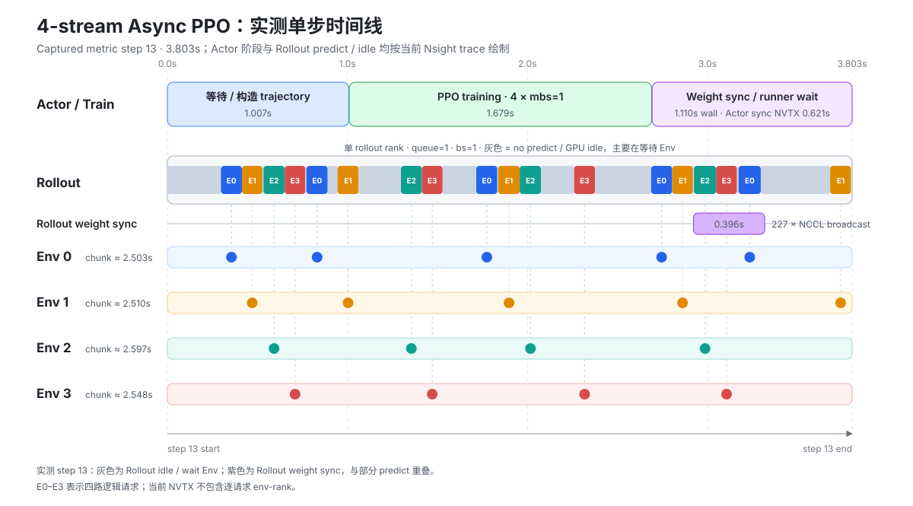

# Turtle2 4-stream Async PPO 单机运行指南

本示例在单节点双 GPU 上运行 pi0.5 Async PPO：GPU0 训练 Actor，GPU1 执行 Rollout，四个 CPU Turtle2 dummy env 并行生成 trajectory，用于走通训练链路。

## 配置

| 组件 | 放置 | 配置 |
|---|---|---|
| Actor | GPU0 | pi0.5 PPO + GAE |
| Rollout | GPU1 | 1 rank，`queue=1`，`bs=1` |
| Env | CPU | 4 个 Turtle2 dummy worker |

四个 Env 均路由到 Rollout `grp0`。每次请求包含三相机图像和 6 维 state，返回 `[50, 6]` action chunk。

配置文件：[realworld_dummy_turtle2_async_ppo_openpi_pi05_2gpu_4stream.yaml](https://github.com/chenchaoxu7575/RLinf/blob/feature/rollout-env-grouproute-nstream/examples/embodiment/config/realworld_dummy_turtle2_async_ppo_openpi_pi05_2gpu_4stream.yaml)

| 关键参数 | 取值 |
|---|---:|
| `total_num_envs` | 4 |
| `micro_batch_size` | 1 |
| `global_batch_size` | 4 |
| `rollout_store_size_per_rank` | 4 |
| `num_action_chunks` | 50 |
| PPO update epoch | 1 |
| Weight sync | 每个 global step |

示例使用 `RLinf-Pi05-LIBERO-SFT` checkpoint。`train_expert_only=true` 冻结 SigLIP vision encoder 和 Gemma expert-0，训练 action expert、projection、value head 和 flow-noise head。

代码版本：[feature/rollout-env-grouproute-nstream](https://github.com/chenchaoxu7575/RLinf/tree/feature/rollout-env-grouproute-nstream)，SHA `06249ee10a2722de8609b5d8b8d0cfaecaed583d`。

## 运行

在 RLinf 容器内执行：

```bash
export PYTHONPATH=/workspace/rlinf_pub/RLinf
export EMBODIED_PATH=/workspace/rlinf_pub/RLinf
export RAY_ENABLE_UV_RUN_RUNTIME_ENV=0
export NCCL_P2P_DISABLE=1

cd /workspace/rlinf_pub/RLinf
python -u examples/embodiment/train_async.py \
  --config-path config \
  --config-name realworld_dummy_turtle2_async_ppo_openpi_pi05_2gpu_4stream \
  actor.model.model_path=/workspace/rlinf_pub/models/RLinf-Pi05-LIBERO-SFT \
  rollout.model.model_path=/workspace/rlinf_pub/models/RLinf-Pi05-LIBERO-SFT \
  runner.logger.log_path=/workspace/artifacts/turtle4_5step
```

默认运行 5 个 global steps，结束时日志显示 `Global Step: 5/5`。

参考环境：2 × RTX PRO 5000 72GB、PyTorch 2.7.1+cu128、Ray 2.54.1。

## Nsight Systems Profile

在启动命令末尾追加：

```bash
cluster.profiling.enabled=true \
cluster.profiling.output_dir=/workspace/artifacts/turtle4_nsys \
runner.max_epochs=13 \
runner.max_steps=13 \
'cluster.profiling.steps=[3,4,5,6,7,8,9,10,11,12]'
```

该配置 warm-up 3 个 step，再通过一个连续 `nsys profile` 窗口采集 10 个 step。ActorGroup 和 RolloutGroup 使用：

```text
nsys profile -t cuda,cudnn,cublas,nvtx,osrt \
  --sample=none --cpuctxsw=none --cuda-memory-usage=true \
  --capture-range=cudaProfilerApi --capture-range-end=stop \
  -o <GROUP_PREFIX> <RAY_WORKER_COMMAND>
```

## Workload 参考

以下数据来自参考环境上 warm-up 后连续采集的 10 个 global steps。



图中的 Actor、Rollout predict/idle 和 Rollout weight sync 时间来自 captured step 13；E0–E3 表示四路 Env 请求。

| 指标 | 实测值 |
|---|---:|
| Global step | 均值 3.598s；中位数 3.332s；范围 2.167–4.955s |
| Rollout-store wait | 均值 0.905s |
| Actor training | 均值 1.704s |
| Actor forward / backward / optimizer | 0.699 / 0.554 / 0.008s per step |
| Weight sync wall time / payload | 0.932s / 1.63GB |
| Rollout predict | 118.1ms/request |
| Env0 / 1 / 2 / 3 chunk | 2.503 / 2.510 / 2.597 / 2.548s |
| 四路聚合吞吐 | 1.112 robot chunks/s |
| Action 吞吐 | 55.585 action vectors/s |
| GPU0 / GPU1 峰值显存 | 23538 / 9370MiB |
